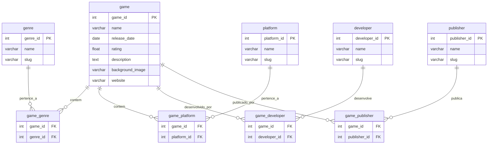

01

```mermaid
erDiagram
    game ||--o{ game_genre : contem
    game ||--o{ game_platform : contem
    game ||--o{ game_developer : desenvolvido_por
    game ||--o{ game_publisher : publicado_por
    genre ||--o{ game_genre : pertence_a
    platform ||--o{ game_platform : pertence_a 
    developer ||--o{ game_developer : desenvolve
    publisher ||--o{ game_publisher : publica

    game {
        int game_id PK
        varchar name
        date release_date
        float rating
        text description
        varchar background_image
        varchar website
    }

    genre {
        int genre_id PK
        varchar name
        varchar slug
    }

    game_genre {
        int game_id FK
        int genre_id FK
    }

    platform {
        int platform_id PK
        varchar name
        varchar slug
    }

    game_platform {
        int game_id FK
        int platform_id FK
    }

    developer {
        int developer_id PK
        varchar name
        varchar slug
    }

    game_developer {
        int game_id FK
        int developer_id FK
    }

    publisher {
        int publisher_id PK
        varchar name
        varchar slug
    }

    game_publisher {
        int game_id FK
        int publisher_id FK
    }
```
### Diagrama de Casos de Uso

